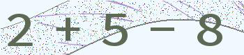

# Verified-code-recognition

# 验证码识别说明

主要提供5类验证码图片，难度依次递增，每一类验证码提供1万个训练样本，最后通过另外5000个测试样本的识别率评分。

## 第1类

数字四则运算，有噪点干扰，输出计算结果。示例：

输出：2+5-8=-1

## 第2类

英文字母+数字验证码，包含5个字符，有噪点干扰，文字无旋转形变，验证方法为要求用户输出验证码中的字符，大小写不限（为验证方便可统一转为大写）。示例：

输出：YFQKX

## 第3类

英文字母+数字验证码，包含4个字符，有噪点干扰，文字有旋转形变，验证方法为要求用户输出验证码中的字符。示例：

		输出：JN2M
## 第4类

中文验证码，包含4个中文汉字，有噪点干扰，验证方法为要求用户选出4个汉字中被旋转90度的那一个（四个汉字从左到右序号为0,1,2,3，输出被旋转的汉字序号即可）。示例：

		输出：0
## 第5类

中文验证码，包含4个中文汉字和9个中文单字，有噪点干扰，文字有旋转形变，验证方法为要求用户从9个单字中从左到右按顺序选出验证码中的汉字，输出汉字；示例：
验证图片：
单字：0 1 2 3 4 5 6 7 8
输出：8267
识别结果验收
1.每一类训练数据集（data-1.zip 到 data-5.zip）文件结构如下：
--- data-x.zip
|--- 说明.txt			----> 该类验证码的数据集说明及测试标准
|--- train/
|--- mapping.txt		----> 训练集数据的识别结果
|--- 0~9999			----> 10000个该类验证码数据集
2.五类验证码相互独立，最后会对五类验证码分开测试，监测数据是每一类5000个，理论上来说需要建立5个模型，但实际上对模型数量不做限制，只要能最后给出相应的输出用来验证；
3.验收时会每一类都给出5000个与训练集数据相似的训练集数据作为输入，要求参赛者对每一类验证码进行识别并输出mapping.txt文件（格式与训练集一致）。也即是说，我们只对最后参赛者根据测试集输出的5个mapping文件进行比对并验证识别率
